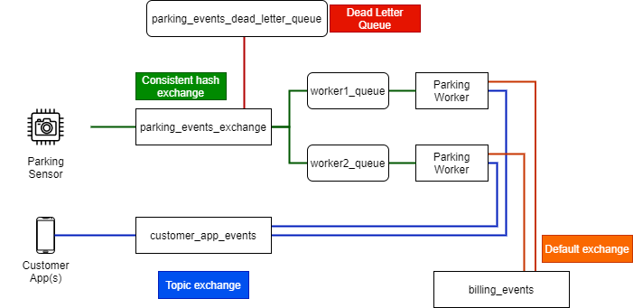

# RabbitMQ-Parking-Tracker

Solution to a RabbitMQ assignment for the Cloud Software and Systems lecture that I needed to complete during my Master's studies at Aalto University.

## Task
The assignment is to build a smart parking application. The scenario comprises a Parking Sensor that detects when cars drive in and out of a parking lot. The application logic resides in the Parking Worker (backend) where entry and exit event messages generated by the parking sensor are processed to calculate a parking cost and to generate billing events. Customers that drive in and out of the parking lot receive alerts on their Customer App when they do so; they also receive billing information for parking when exiting the parking lot.

My task is to create the necessary RabbitMQ messaging exchanges and queues for such a scenario as specified in the Requirements below.

### Explicative diagram of the architecture

